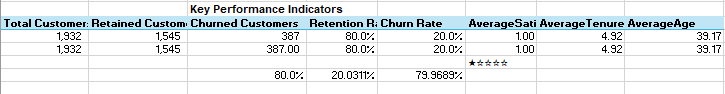

# Bank Churn Analysis - Excel, Power Query, DAX.

# Table of contents

- [Project brief](#Projectbrief)
- [Objective](#Objective)
- [Key Questions to Answer](#KeyQuestionstoanswer)
- [Data source](#Datasource)
- [Tools](#Tools)
- [Dashboard design charts](#Dashboarddesignchart)
- [Stages](#Stages)
- [Data processing & Transformation](#Datacleaning&processing)
- [Insights](#Insights)
- [Recommendations](#Recommendations)
- [Action Plan](Actionplan)

# Project Brief 
Bank Customer Churn Analysis

## Project Overview
This project objective is to analyze an accident report dataset to uncover patterns and insights related to road safety. It includes trends in accident frequency, locations, times, and causes. The goal is to help improve decision-making and reduce future accidents through data-driven insights.

## Key Questions to Answer

1.	What is the total number of casualties?
2.	What are the total casualties by accidents severities?
3.	Compute the percentage by casualties.
4.	What road condition does accident mostly occurs?
5.	Accident occurs frequently in what light condition?
6.	What road type does accident mostly occurs?
7.	What area does accident mostly occurs?
8.	What weather condition does accident mostly occurs?
9.	What are the casualty rates by junction control?
10.	Compute the number of casualties caused by police force?
11.	How often does accident occurs monthly?
12.	What year has the highest casualties? 

## Data Source

## Tools

| Tools | Purpose | 
| --- | --- | 
| Excel |  Cleaning, Processing, Analysis & Visualization |

## Dashboard Design
Here are the different (appropriate) chart and icons used in telling the data story.

1.	KPI Score cards
2.	Column chart
3.	Donut chart
4.	Area chart
5.	Icons 
6.	Bar chart
7.	Combo chart
   

## Stages
Here’s a step-by-step details on how the data was approached 

1.	Get Data
2.	Load into Excel
3.	Clean and process with Power Query, DAX
4.	Visualize using Excel
5.	Generate Insights
6.	Give recommendations
7.	Take action plan

## Data Cleaning & Processing 
Here's how the data was cleaned and processed before its readiness for analysis.

# KPIs

# Churn by Age

# Churn by Age bracket

# Churn by Geography

# Churn by Age Gender

# Churn by Card Type

# Churn by CreditCard

# Churn by Complaint

# Churn by Tenure

# Avg Balance Churn vs Retained

# Churn by Creditscore

# Churn by NumofProduct

# Churn by Satisfaction score

## Insights

•	Cars account for the overwhelming majority of casualties (333.5K out of 418K).

•	Motorcycles and vans follow, but at much lower numbers.

•	Most casualties occur on single carriageway roads.

•	Dual carriageways and roundabouts also have notable numbers.

•	Accidents mostly occur during fine weather with no high winds.

•	Around 73% of accidents happen in darkness, suggesting visibility plays a major role.

•	Majority of accidents are slight (85.49%), but serious (13.23%) and fatal (1.28%) still make up a concerning share.

•	November sees the highest monthly casualties, with a gradual decline until February.

•	This may correlate with shorter daylight hours or weather conditions.

•	Urban areas have more casualties than rural areas, likely due to higher traffic density.

•	Most casualties occur at 'Give way or uncontrolled' junctions.

•	Poor or missing data on junction control also contributes to high accident counts.

•	Majority of accidents happen on dry roads, followed by wet or damp surfaces.

## Recommendations

•	Focus safety campaigns and infrastructure improvements in urban areas, especially targeting car users.

•	Since most accidents occur in darkness, increase the use of reflective signs, better street lighting, and vehicle visibility regulations.

•	Redesign or control 'Give way' junctions more effectively, possibly adding traffic signals or roundabouts.

•	Promote defensive driving programs especially in fine weather, as driver overconfidence may lead to accidents.

•	Add rumble strips, barriers, or speed calming measures on single carriageways to reduce risks.

•	Launch public awareness and enforcement campaigns in late autumn (Oct–Nov) when accidents spike.

## Action Plan

•	Audit and improve road safety in high-casualty urban zones.

•	Install better lighting in high-incident dark areas.

•	Analyze top dangerous junctions and upgrade control measures.

•	Seasonal campaigns about safe driving in good weather & dark hours.

•	Review policies for single carriageways and car safety.

