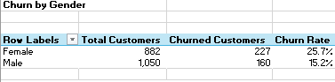

# Bank Customer Churn Analysis - Excel

# Table of contents

- [Project brief](#Projectbrief)
- [Objective](#Objective)
- [Key Questions to Answer](#KeyQuestionstoanswer)
- [Data source](#Datasource)
- [Tools](#Tools)
- [Dashboard design charts](#Dashboarddesignchart)
- [Stages](#Stages)
- [Data processing & Transformation](#Datacleaning&processing)
- [Insights](#Insights)
- [Recommendations](#Recommendations)
- [Action Plan](Actionplan)

# Project Brief 
Bank Customer Churn Analysis

## Project Overview
This report analyzes customer churn patterns to identify key drivers influencing attrition across demographics, geography, product usage, and satisfaction levels. The goal is to uncover actionable insights that help reduce customer churn, improve retention, and maximize customer lifetime value.

## Key Questions to Answer

1.	What is the overall churn rate and retention rate?

2. Which customer segments are most at risk of churning?

   • By gender (male vs female)

   • By age group (young, middle-aged, old, very old)

   • By geography (Spain, Germany, France)

   • By card type (Diamond, Gold, Platinum, Silver)

3. How does customer satisfaction impact churn?

4. What is the relationship between customer tenure and churn?

5. Do complaints influence churn, and to what extent?

6. How does the number of products owned affect churn?

7. What is the churn trend by customer age and credit score?

8. What is the financial impact of churn?

9. Comparing average bank balances of retained vs churned customers.

## Data Source

## Tools

| Tools | Purpose | 
| --- | --- | 
| Excel |  Cleaning & Processing (Power Query, DAX) | Analysis & Visualization |

## Dashboard Design
Here are the different (appropriate) chart and icons used in telling the data story.

1.	KPI Score cards
2.	Column chart
3.	Donut chart
4.	Progress bar chart
5.	Rating stars
6.	Bar chart
7.	Combo chart
   

## Stages
Here’s a step-by-step details on how the data was approached 

1.	Get Data
2.	Load into Excel
3.	Clean and process with Excel Power Query & DAX
4.	Visualize using Excel Charts
5.	Generate Insights
6.	Give recommendations
7.	Take action plan

## Data Cleaning & Processing 
Here's how the data was processed and transformed before its readiness for analysis.

# KPIs

# Churn by Age

# Churn by Age bracket

# Churn by Geography

# Churn by Age Gender

# Churn by Card Type

# Churn by CreditCard

# Churn by Complaint

# Churn by Tenure

# Avg Balance Churn vs Retained

# Churn by Creditscore

# Churn by NumofProduct

# Churn by Satisfaction score

## Insights

•	Total Customers: 10,000, Churned Customers: 2,038 (20.4% churn rate), Retained Customers: 7,962 (79.6%)

•  Average Satisfaction Score: 3.01 (neutral, not impressive), Average Age: 38.92 years, Average Tenure: 5.01 years

•  Female churn rate = 25.1% (higher), Male churn rate = 16.5% (lower)

•  Old customers churn the most (49.9%), Middle-aged: 22.6%, Young: 7.9%, Very old: 19.6%

•  Germany has the highest churn at 32.4%, Spain = 16.7%, France = 16.2%

•  Customers with Diamond card type churned the 21.8% (highest), with Gold being the least at 19.3%. Platinum: 20.4%, Silver: 20.1%

•  Lower satisfaction strongly correlates with higher churn.

•  Customers rating 1–2 stars churn far more than 4–5 star customers.

•  Customers with only 1 product churn less.

•  Customers with 2+ products churn heavily (up to 100%).

•  Customers who lodged complaints = 100% churn.

•  Average bank balance of churned customers = $91,097 and Retained customers = $72,768

•  Churned customers have higher balances, meaning losing them has bigger financial impact.

•  Churn slightly negatively correlated with credit score (low scores churn more).

## Recommendations

•	Prioritize female customers, older customers, and those in Germany.

•  Tailored retention strategies (loyalty rewards, targeted communication, personal financial advisors).

•  Satisfaction score is average (3.01).

•  Improve service quality, faster resolution of issues, better engagement programs.

•  Since 100% of customers who complain churn, implement a proactive complaint resolution team.

•  Introduce “customer recovery program”: follow-up calls, compensation, service recovery guarantees.

•  Customers with multiple products churn more, suggesting complexity, hidden costs, or dissatisfaction with upselling.

•  Conduct surveys to identify pain points in bundled products and redesign them for transparency & value.

•  Churned customers have higher bank balances ($91k vs $72k).

•  Create a VIP retention program offering premium support, personalized financial advice, and loyalty perks to retain these high-value customers.

•  Germany shows extreme churn (32.4%).

•  Investigate root causes (regulatory issues, competition, dissatisfaction).

•  Launch localized campaigns & offers in Germany to rebuild trust.

## Action Plan

•	Build a “Customer Retention Task Force” to monitor churn signals in real time.

•  Launch a complaint fast-resolution unit (target: 24–48hr resolution).

•  Send personalized retention offers to high-value customers (balance > $80k).

•  Conduct a quick survey targeting Germany, females, and older customers to uncover churn reasons.

•  Improve customer satisfaction by revamping onboarding, support, and communication.

•  Redesign multi-product packages for transparency and customer benefit.

•  Roll out loyalty rewards program for long-tenured customers.

•  Implement predictive churn models using customer data (credit score, tenure, product count, complaints).

•  Expand customer success teams regionally (esp. Germany).

•  Build customer advocacy programs (referrals, community engagement).

## Measurable Outcome 

By implementing the recommendations from this analysis, the Bank aims to reduce churn rate by 5–8% within the next 6–12 months, increase average customer satisfaction score from 3.01 to 4.0, and retain at least $15M in customer bank balances that would otherwise be lost due to attrition.

